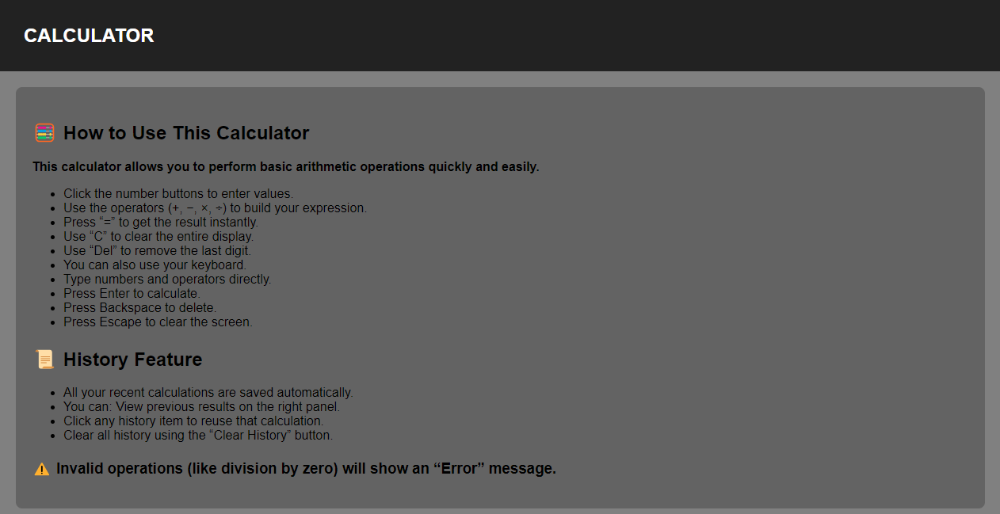

# 🧮 Advanced Calculator

A modern, feature-rich calculator built using HTML, CSS, and JavaScript, designed to deliver fast, accurate, and seamless mathematical operations directly in the browser. This project combines clean UI design with powerful functionality, making it both a practical tool and a strong demonstration of front-end development skills.
 
## 🚀 Live Demo
👉 https://itzsohammane.github.io/Advanced-Calculator
  
## 📸 Screenshots
 

 

 

 
<h2>📌 Features</h2>
<dl>
    <dt>➕ Basic Arithmetic Operation:</dt>
        <dd>Perform addition, subtraction, multiplication, and division with real-time results.</dd>
         
    <dt>⌨️ Keyboard Support:</dt>
        <dd><b>Fully functional keyboard input:</b>
            <ol>
                <li>Numbers & operators for input.</li>
                <li>Enter to calculate.</li>
                <li>Backspace to delete.</li>
                <li>Escape to clear display.</li>
            </ol>
        </dd>
         
    <dt>🧠 Smart Calculation Engine</dt>
        <dd>
            <ol>
                <li>Evaluates expressions instantly.</li>
                <li>Handles invalid operations (e.g., division by zero) with proper error display.</li>
            </ol>
        </dd>
         
    <dt>📜 Calculation History</dt>
        <dd>
            <ol>
                <li>Automatically stores recent calculations.</li>
                <li>Displays history in a dedicated panel.</li>
                <li>Click any history item to reuse the expression.</li>
            </ol>
        </dd>
         
    <dt>💾 Persistent Storage</dt>
        <dd>
            <ol>
                <li>Uses localStorage to save history.</li>
                <li>Retains data even after page reload.</li>
            </ol>
        </dd>
         
    <dt>🧹 History Management</dt>
        <dd>
            <ol>
                <li>Clear entire history with a single click.</li>
                <li>Confirmation prompt for safety.</li>
            </ol>
        </dd>
         
    <dt>🔙 Backspace Functionality</dt>
        <dd>
            Delete last entered digit without clearing full input
        </dd>
         
    <dt>🎨 Responsive & Clean UI</dt>
        <dd>
            <ol>
                <li>Modern dark-themed interface.</li>
                <li>Grid-based button layout.</li>
                <li>Interactive hover and click effects.</li>
            </ol>
        </dd>
</dl>
 
<h2>🛠️ Tech Stack</h2>
<ol>
    <li>HTML5 – Structure.</li>
    <li>CSS – Styling and layout (Flexbox & Grid).</li>
    <li>JavaScript (Vanilla) – Logic and interactivity.</li>
</ol>
 
<h2>📂 Project Structure</h2>

📁 Advanced Calculator 
├── index.html  &nbsp; &nbsp;   # Main structure 
├── style.css     &nbsp; &nbsp; # Styling and layout 
├── logic.js    &nbsp;   &nbsp; # Core functionality 
 
<h2>⚙️ How It Works</h2>
<ol>
    <li>User inputs values via buttons or keyboard.</li>
    <li>Expressions are dynamically built in the display.</li>
    <li>On clicking =, the expression is evaluated using JavaScript.</li>
    <li>Results are shown instantly and stored in history.</li>
    <li>History is rendered dynamically and stored in localStorage.</li>
</ol>
 
<h2>🎯 Key Highlights</h2>
<ol>
    <li>Real-time DOM manipulation.</li>
    <li>Efficient event handling.</li>
    <li>Local storage integration.</li>
    <li>User-centric design with enhanced usability.</li>
</ol>
 
<h2>📌 Future Enhancements</h2>
<ol>
    <li>Scientific calculator functions.</li>
    <li>Theme customization (light/dark toggle).</li>
    <li>Mobile responsiveness improvements.</li>
    <li>Export/download calculation history.</li>
</ol>
 
<h2>📄 License</h2>
<h4><b>This project is open-source and available for learning and personal use.</b></h4>